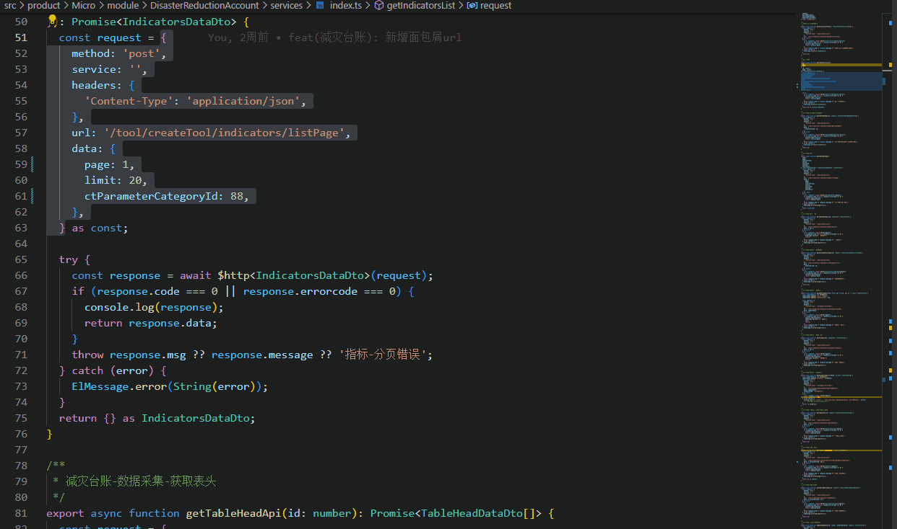

# Api2ts

这是一个自动将 http 的响应数据转化为 ts 的类型，使用 json-to-ts 做的。

## Features

框选配置项后，使用快捷键 alt+Q :



## 请求参数配置文件

在根目录下创建 Api2ts.config.json 文件，配置项如下：

```txt
{
  "baseURL": "https://${host}.com", // 后端请求接口域 必填
  "token": "xxxxxxxxx", // 请求headers携带的token 必填
}
```

请求示例的范本：

```js
const request = {
  method: 'post', // 请求方式 必填
  headers: {
    'Content-Type': 'application/json', // headers头配置 默认是'application/json' 非必填
  },
  url: '/aaa/bbb', // 请求路径 必填
  data: {
    page: 1,
    limit: 20,
    ctParameterCategoryId: 88,
  }, // 请求参数 非必填
};
```

## update 配置文件命令

如若 Api2ts.config.json 配置文件进行修改保存，调出命令面板 cmd + shift + p，敲上 api2ts update 命令，已再次获取 Api2ts.config.json 配置文件。

**Enjoy!**
